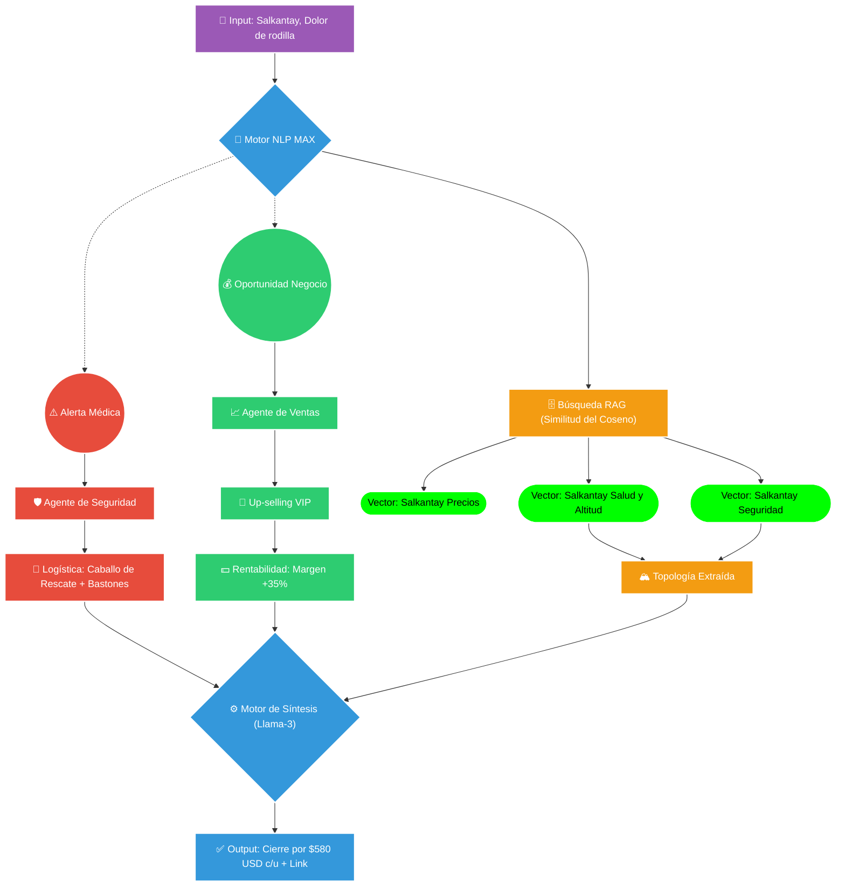

# 🧠 Cerebro Lifextreme: Escala Masiva + Precisión Láser

Este diagrama demuestra cómo el Motor RAG tiene acceso a toda la bóveda (Huchuy Qosqo, Ausangate), pero dispara un láser de precisión matemática únicamente hacia los vectores de Salkantay.

